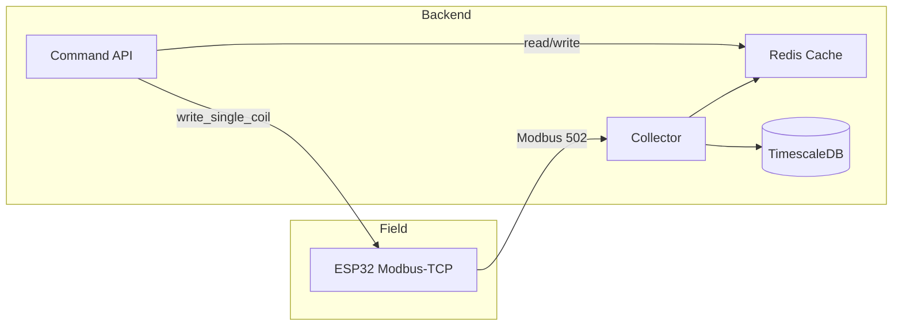

## Arquitectura lógica

* El Collector lee Holding Registers y Coils cada segundo.
* Command API expone `/api/*` y WebSocket; toma datos de Redis y escribe Coils.
* TimescaleDB guarda el histórico para Grafana.
